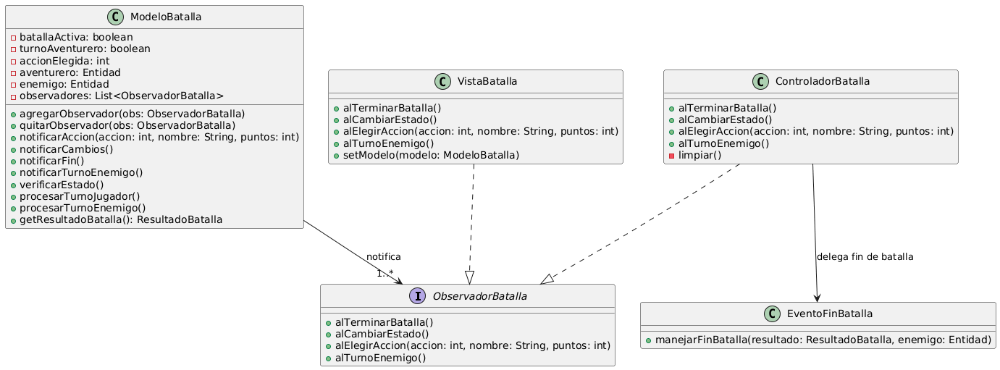
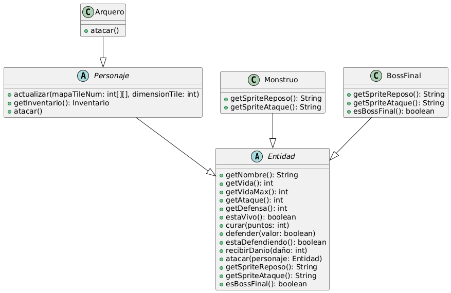
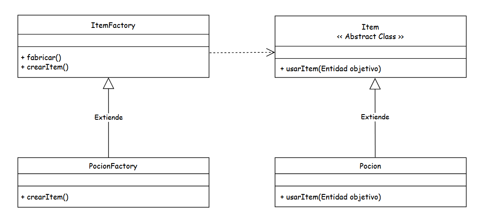
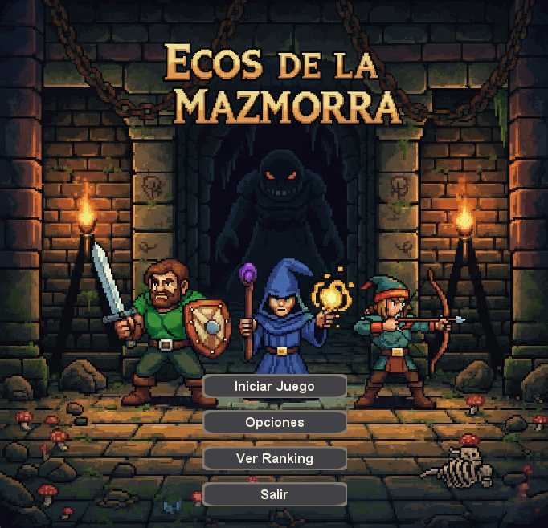
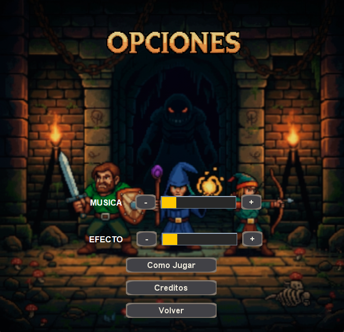
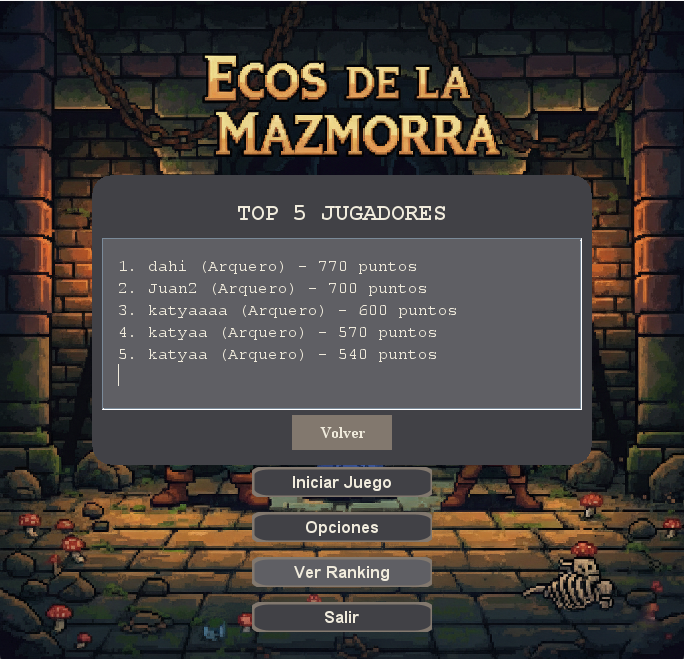
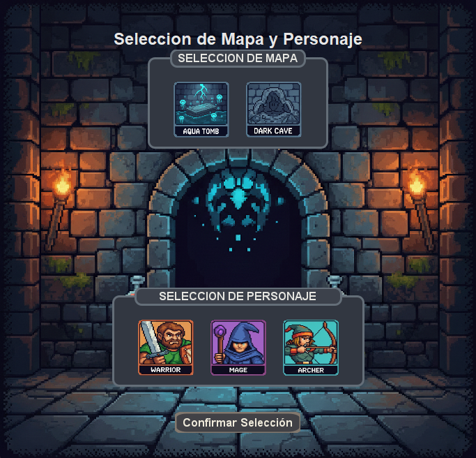
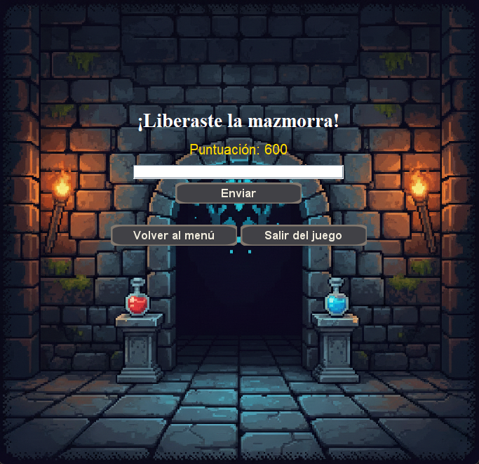
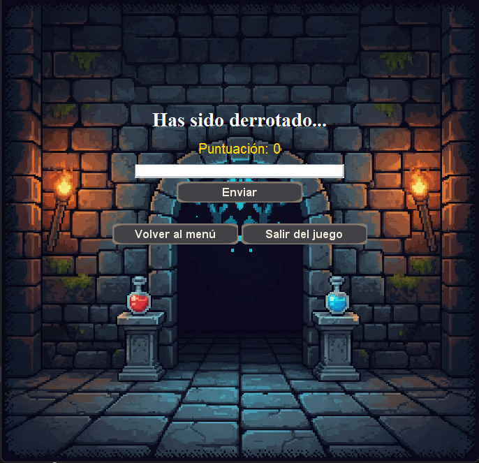

# Proyecto: Juego RPG por Turnos - Ecos de la Mazmorra 
 
## 1. Integrantes del Equipo  
- AYALA, EMILIANO LEONARDO
- GUZMAN, KATYA MORENA
- MIRANDA, JUAN MANUEL ALEJANDRO
- WILLIAMS, DAHIANA

 
## 2. Dominio y Alcance del Sistema  
 
### Descripción del Problema 
Se busca desarrollar un juego de escritorio del estilo RPG por turnos, donde el jugador controla un ‘aventurero’, que va a explorar la mazmorra, tiene la opción de elegir entre tres tipos, diferenciados entre sí por los puntos de Ataque y Defensa. 
 
### Objetivo del Sistema 
El sistema será un juego funcional y extensible que permita al jugador experimentar las mecánicas básicas de un RPG de combate por turnos y exploración en un mapa 2D. El diseño debe ser modular para facilitar la adición de nuevas clases de personajes, enemigos, objetos y mazmorras en el futuro. Se busca que la interfaz sea sencilla e intuitiva.

El objetivo del personaje es explorar y avanzar dentro de una mazmorra, enfrentarse en batallas contra monstruos acordes a la temática de la misma, reunir y utilizar consumibles esparcidos por el mapa. Tras salir victorioso de 5 de ellas finalmente se desbloquea el jefe final, el cual significa la última batalla y fin de juego. 
### Pilares de Programación Orientada a Objetos aplicados en el proyecto

Abstracción: Aplicamos la abstracción mediante la clase abstracta Entidad que define los comportamientos comunes como atacar() y getSpriteReposo() sin especificar como se implementan. Asimismo, la abstracción se aplica en el uso de interfaces como Observador, SujetoObservable y clases abstractas como ItemFactory, que definen contratos de comportamiento independientes de las implementaciones concretas. Esto permite crear clases que colaboran entre sí a través de interfaces, reduciendo el acoplamiento y facilitando futuras ampliaciones del juego.

Encapsulación: En nuestro juego aplicamos encapsulamiento en nuestra clase principal ”Entidad” utilizando atributos protegidos tales como nombre,vida, ataque y defensa que se utilizara por sus subclases. Para tener un acceso controlado utilizamos métodos públicos como curar(), defender(), recibirDanio(). De esta forma, se impide la modificación directa de los valores críticos del juego (como la vida o el puntaje) desde fuera del objeto, preservando la integridad del modelo. El encapsulamiento también se observa en otras partes del proyecto, como en el Inventario, donde los ítems solo pueden agregarse o eliminarse mediante los métodos públicos agregarItem() y eliminarItem(), evitando inconsistencias y favoreciendo el mantenimiento del código.

Herencia: En nuestro juego se encuentra herencia principalmente en la clases Personaje, Monstruo, BossFinal, los tres heredan los procedimientos de la clase Entidad, quien representa a todas las entidades de nuestro juego. Algunas clases sobreescriben métodos, como BossFinal al sobreescribir esBossFinal(), otras sólo utilizan el método base dado.

Polimorfismo: En nuestro juego un ejemplo de polimorfismo es dentro de Sistema de Batalla, en las clase ModeloBatalla, el manejo de turnos es polimórfico el método procesarTurno recibe un objeto entidad y utiliza los métodos atacar() y defender() definidos en la instancia que ingrese y herede de la clase entidad. Estos métodos pueden estar sobreescritos, pero el método delega esa implementación al objeto Entidad que ingrese.

### Funcionalidades Principales (Features) -
 **Gestión de Personajes:** 
- El jugador puede elegir entre distintos tipos de personajes (ej: Guerrero, Arquero, Mago). Para la versión demo sólo está habilitado el personaje Arquero.
- Cada personaje tiene atributos iniciales (vida, ataque, defensa).
- El jugador podrá elegir diferentes tipos de pociones (Poción pequeña, Poción Grande)
- El inventario tendrá un máximo de 5 espacios para objetos consumibles. 

**Sistema de Exploración y Mazmorras:** 
- El jugador puede elegir entre diferentes tipos de mazmorras temáticas (ej: Acuáticas, Cueva, Ruinas).Para la versión demo sólo está habilitada la mazmorra ruinas.
- Cada mazmorra contiene enemigos determinados según su temática.
- El jugador explora un escenario delimitado por muros, que contiene los consumibles para utilizar como ventaja en las batallas que se presenten, incluyendo jefe final.

**Sistema de Combate por Turnos:** 
- Los combates con enemigos se dan de forma aleatoria durante la exploración, está atado a una probabilidad de pasos.
- El combate con el jefe final tras un número arbitrario de batallas simples victoriosas, no cuentan las huidas en batalla. El ataque y la defensa dependen de los atributos del personaje, los objetos equipados y su tipo.

**Mecanicas de juego**
- El jugador cuenta con una cantidad limitada de puntos de vida, todos los personajes comparten el mismo máximo de vida. La partida termina si llegan a cero o si se derrota al jefe final.
- Derrotar enemigos se contabiliza como victoria y suman al progreso para jefe final.

- Durante el juego, el puntaje del jugador se contabiliza de la siguiente forma: por monstruo derrotado, pociones consumidas, derrota del boss final y si el jugador huyó de la batalla. 

**Sistema de puntuacion**
Durante el juego, el puntaje del jugador se contabiliza de la siguiente forma:
Por **monstruo derrotado**: Cada monstruo derrotado en una batalla otorga una cantidad específica de puntos. 
Por **porciones consumidas**: El uso de pociones durante las batallas o durante la exploración de la mazmorra resta puntos al puntaje final. 
Por **derrota del monstruo final**: Al vencer al jefe final como bonificación se otorga una cantidad específica de puntos.
Por **huir** de la partida: En caso de que el jugador decida huir de una batalla, se restará cierta cantidad de puntos. 

**Interfaz Gráfica (IGU):** 
- Menú Principal: Título del juego y botones para "Nueva Partida","Opciones", "Ranking" y "Salir".
- Panel de Selección: Interfaz para elegir personajes y mazmorras.
- Panel Opciones: Controlador de volumen Música y Efecto, Breve Cómo Jugar, boton para volver.
- Panel Ranking: Dialog que muestra los top 5 jugadores.
- Interfaz de Combate: Visualización de personajes, enemigos, barras de estado (vida) y un panel de control para elegir acciones (atacar/defender), usar objetos.
- Panel final: Sección para ingresar nombre y así almacenar puntaje, botón volver a menú principal y salir(cerrar) juego.

**Persistencia** 
- Guardado del puntaje jugador en una base de datos SQLite.
## Instrucciones para el juego
Ejecutar desde clase Main, con Run Java. Para empezar a jugar apretar botón Iniciar Juego, seleccionar Mazmorra (Ruinas) y Personaje (Arquero), presionar Confirmar. Para moverse se utilizan las teclas arriba, abajo, izquierda, derecha; para abrir inventario en exploración se utiliza la tecla (I), en Batallas se utiliza el botón INVENTARIO; para recoger consumibles se utiliza la tecla (E); para navegar en inventario, una vez abierto, se utilizan las teclas arriba, abajo, y enter para consumir. Para interactuar con el Boss una vez llegado al mínimo de victorias se debe apretar la tecla ESPACIO, para ir a opciones apretar tecla esc.
 
## 3. Arquitectura y Diseño 

### Patrón de Diseño Adicional: Factory Method - **Entidad Factory:** 
**Factory Method (Método de Fábrica)**. 
- **Justificación:** Se utilizará este patrón para la creación de los objetos `Personaje`, ‘Enemigo’, ‘Jefe Final’ e ‘item’. 

Para personajes: una clase abstracta `EntidadFactory` con un método `crearPersonaje()`. Se crearán subclases concretas como `Arquero’ el Producto Concreto y `CuartelArquero` la fábrica concreta. que implementarán este método para instanciar los personajes correspondientes. 

Para enemigos: una clase abstracta ‘’MonstruoFactory’ con un método ‘crearMonstruo()’, se crearán subclases concretas como ‘Monstruo’ Producto Concreto y  ‘FabricasMonstruoRuinas’ es la fábrica concreta.

Para jefe final: una clase abstracta ‘BossFactory’ con un método ‘crearBoss()’, se crearán subclases concretas como ‘BossFinal’ el Producto Concreto y ‘FabricaBossRuinas’ es la fábrica concreta.

El patrón **Factory Method** se aplicó para desacoplar la creación de objetos ítem del código cliente.  
Se definió una clase abstracta `ItemFactory` y una subclase concreta `PocionFactory`, encargada de generar instancias de distintos tipos de pociones según el identificador recibido (`POCION_PEQUENA`, `POCION_GRANDE`, etc.).  
Este mecanismo se integró con el sistema de **pickups del mapa**, donde cada tile ID está asociado a una fábrica específica dentro de un catálogo (`Map<Integer, ItemFactory>`).  
Gracias a esta estructura, el juego puede generar ítems de manera dinámica y extensible, respetando el **principio Abierto/Cerrado (Open/Closed)**.  
Además, al centralizar la lógica de creación en una única fábrica, se facilita la incorporación de nuevos tipos de ítems y se mejora la **mantenibilidad y escalabilidad** del sistema.

- **Nombre del Patrón:** **Patron Observer**. 

- **Justificación:** Se utiliza este patrón para implementar el sistema de puntuación, Inventario, Sistema de batallas. 

Se define la interfaz SujetoObservable que contiene todos los metodos necesarios para notificar los observadores: registrar observador(), remover observador(), notificarObservadores(). 
Se define la interfaz Observador con el metodo actualizar() que se utiliza cuando el estado del sujeto cambia. 
La clase ModeloJuego (Concrete Subjet) implementa SujetoObservable ya que contiene el estado del puntaje total del juego. Cada vez que el puntaje cambia (al derrotar monstruos, consumir pociones, huir de una batalla o derrotar al monstruo final) el modelo notifica a sus observadores registrados mediasnte el metodo sumarPuntaje().
La clase ControladorUI (Concrete observer) implementa Observador y se registra al ModeloJuego para recibir notificaciones. Su metodo actualizar() se ejecuta cada vez que el modelo notifica un cambio y actualiza los elementos visuales de mi vistaUI. 

Se implementó el patrón **Observer** en el sistema de **Inventario** para mantener la sincronización automática entre el modelo y la interfaz gráfica.  
La clase `Inventario` cumple el rol de **Sujeto Observable**, mientras que la vista `VistaInventario` implementa la interfaz de **Observador**.  
Cada vez que el modelo sufre un cambio (como la adición, uso o eliminación de un ítem), el inventario notifica a todos los observadores registrados, provocando que la interfaz se actualice de manera inmediata y consistente.  
Este diseño reduce el acoplamiento entre la lógica interna y la presentación, mejora la coherencia visual y refuerza la arquitectura **MVC**, ya que el controlador no necesita forzar manualmente la actualización de la vista.  

Para el Sistema de batallas se implementa el Patrón Observer para la actualización de la vistaBatalla en respuesta a las notificaciones del ModeloBatalla: Actualizando cada subpanel, log de acciones, sprite enemigo, botones, labels. 
La clase ModeloBatalla (Concrete subjet) es el sujeto observable porque contiene los estados de batalla, y la lógica de turnos, como sujeto observable implementa las siguientes notificaciones: notificarAccion(), notificarCambios(), notificarFin() este se utiliza en el método verificarEstado() este chequea si se terminó la batalla, los tres se utilizan en el método ProcesarTurno(); notificarTurnoEnemigo() se utiliza dentro de ProcesarTurnoJugador(), así tras el turno del jugador se pasa el turno al enemigo.

Las clases VistaBatalla y ControladorBatalla son Concrete Observer, ambos se registran como observadores del modelo. Se define la interfaz ObservadorBatalla() que contiene los métodos necesarios para que los observadores respondan a las notificaciones: alTerminarBatalla(), alCambiarEstado(), alElegirAccion(), alTurnoEnemigo() sólo vistaBatalla implementa todos lo métodos, el controlador implementa alTerminarBatalla para poder responder pasando el flujo al ControladorJuego(Define vuelta a mapa de exploración o vistaFinBatalla) que es el controlador principal.

- **Nombre del Patrón:** **Patron Singleton**. 
- **Justificación:** Se utiliza este patrón para implementar el sistema de Sonido de todo el juego.

La clase Sonido tiene el objetivo de garantizar que solo exista una unica instancia de esta clase en toda la ejecución del juego. 
Esto permite que diferentes clases del juego por ejemplo (ControladorUI o ControladorMenuPrincipal) puedan acceder al mismo gestor de Sonido mediante el metodo getInstancia() sin necesidad de crear nuevos objetos ni generar alto acoplamiento. 

- **Nombre del Patrón:** **Patron DAO + Singleton**. 
- **Justificación:** Se utiliza la combinación de estos patrones para implementar el sistema de Base de datos que utiliza el juego.

Utilizados en la clase ConexionBaseDeDatos(Singleton) para tener una única instancia de datos. Esta clase realiza la creación y conexión de la base de datos, genera la tabla ranking, la cual, mediante SQLite realiza la centralización de la información obtenida a través del juego.
Y La interfaz DAO(Data Acess Object) para la abstracción de acceso a los datos, la cual es implementada en la clase PuntajeDAOImp.
 
### Diagramas de Diseño 
 
#### **Diagrama de Clases UML (Conceptual)**

- Patrón Observer en Sistema Batallas

- Patrón Observer en Sistema Inventario

- Herencia en Entidad

- Factory Method para creación de entidades

- Factory Method para creación de Items

- Singleton + DAO para la aplicación en una unica instancia de la base de datos

- Patron Observer para implementar el sistema de puntuación del juego.

- Singleton para gestionar el sistema de audio del juego.

#### **Prototipo de la IGU (Wireframe)** 

- Menu Principal: Título del juego, con botones de menú claramente visibles: Iniciar Juego, Opciones, Ver Ranking y Salir.

- Pantalla Opciones: Controlador volumen Musica y efectos, botón tutorial, botón volver

- Ranking: Dialog con top 5 jugadores, consulta a la base de datos

- Panel de Selección: Lista de personajes presentados en tarjetas (con imagen, atributos) junto a un selector de mazmorras. Botón "confirmar".

- Pantalla de Dialogo: Pantalla de dialogo introductorio que indica como jugar, el objetivo y recomendaciones en el juego.

- Pantalla de Juego: Se muestra el personaje, el mapa con su mapa elegido y sus respectivos estados tanto de la cantidad de batallas, como la vida del jugador y su puntaje.

- Pantalla de Inventario: Inventario del jugador con los consumibles que podrá utilizar en las batallas y en el mapa. 

- En el centro se muestran los sprites del enemigo, debajo el log de combate, con los botones para las acciones e inventario, junto a los stats del personaje y el enemigo en combate.
 

- Batalla con BossFinal

- Pantalla mostrada al finalizar una partida. Victoria

- Pantalla mostrada al finalizar una partida. Derrota

## 4. Stack Tecnológico  - **Lenguaje:** Java 24 - **IDE:** Visual Studio Code - **Base de Datos:** SQLite (para persistencia de High Scores) - **Framework de IGU:** Java Swing - **Control de Versiones:** Git y GitHub Classroom 
